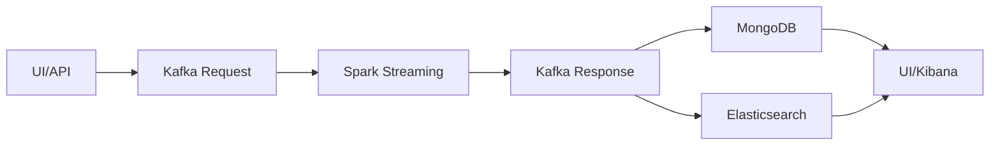

[](https://python.org/) [](https://spark.apache.org/) [](https://mongodb.com/) [](https://elastic.co/) [](https://elastic.co/) [](https://kafka.apache.org/)

# BigOpsFlow

Pipeline de prediccion en tiempo real para Food Delivery. Entrena un modelo en Spark y sirve resultados por streaming con trazabilidad en bases de datos y analitica.

## Flujo de datos





Para detalles específicos de cada método de despliegue, ver `Compose/README.md` o `Kubernetes/README.md`.

## Opciones de despliegue
| | Docker Compose | Kubernetes |
| --- | --- | --- |
| Uso recomendado | Local, dev, demo | Cluster o entorno K8s |
| Entrada de prediccion | Flask UI en `http://localhost:5050` | Web UI en `http://localhost:30060` + API en `http://localhost:5050` |
| Entrenamiento | Notebooks via microservicio (Papermill) | Job `spark-submit-train` |
| Persistencia | Volumenes Docker | PV/PVC hostPath |
| Guia completa | `Compose/README.md` | `Kubernetes/README.md` |

## Inicio rapido
**Docker Compose**:
```bash
cd Compose
docker compose up -d --build
```
Detalles, puertos y checks en `Compose/README.md`.

**Kubernetes**:
```bash
cd Kubernetes
docker build -t spark:4.0.1-py spark4-py
./apply-stack.sh
```
Pasos de entrenamiento, streaming y endpoints en `Kubernetes/README.md`.

## Estructura del repo
- `Compose/` stack local con Docker Compose, notebooks y scripts
- `Kubernetes/` manifiestos y utilidades para K8s
